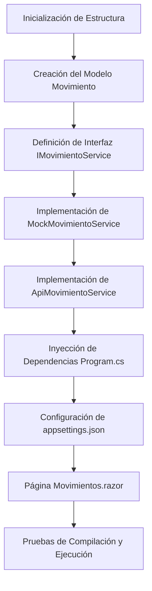

# 01 - Bitácora de Desarrollo Paso a Paso (Project Walkthrough)

Este documento detalla el proceso cronológico seguido para construir la solución **ZiurSoftwareChallenge**, desde la inicialización hasta la verificación en ejecución de los datos mockeados.

---

## 1. Creación del Modelo de Datos
Se definió el modelo de transferencia de datos en [Movimiento.cs](file:///c:/Users/Lenovo/ZiurSoftwareChallenge/src/ZiurSoftwareChallenge/Models/Movimiento.cs) con el propósito de representar exactamente la estructura JSON esperada por Ziur Software:
* `Codigo` (`int`)
* `Descripcion` (`string`)
* `VActiva` (`bool`)

---

## 2. Definición del Contrato del Servicio (Abstracción)
Se creó la interfaz [IMovimientoService.cs](file:///c:/Users/Lenovo/ZiurSoftwareChallenge/src/ZiurSoftwareChallenge/Services/IMovimientoService.cs) en la carpeta `Services/`. Esta interfaz provee el contrato asíncrono `ObtenerMovimientosAsync()` que expone los datos, garantizando que el frontend dependa únicamente de esta firma y no de la implementación de red.

---

## 3. Implementación del Servicio Mock (Simulación)
Dado que el endpoint de Ziur Software se encuentra en desarrollo, se creó la clase [MockMovimientoService.cs](file:///c:/Users/Lenovo/ZiurSoftwareChallenge/src/ZiurSoftwareChallenge/Services/MockMovimientoService.cs). 
* Implementa una latencia de red simulada de 500 milisegundos (`await Task.Delay(500)`).
* Retorna en disco duro los 3 registros exigidos en la prueba con sus respectivas propiedades.

---

## 4. Implementación del Servicio API Real
Se desarrolló de forma paralela la clase [ApiMovimientoService.cs](file:///c:/Users/Lenovo/ZiurSoftwareChallenge/src/ZiurSoftwareChallenge/Services/ApiMovimientoService.cs) que utiliza `HttpClient` inyectado para comunicarse asíncronamente vía REST y deserializar la lista de movimientos desde `api/movimientos`. Incluye gestión robusta de excepciones (`HttpRequestException`) y registros de log a consola.

---

## 5. Inyección de Dependencias Dinámica y Configuración
* Se agregó el parámetro `"Api:UseMock"` en [appsettings.json](file:///c:/Users/Lenovo/ZiurSoftwareChallenge/src/ZiurSoftwareChallenge/appsettings.json).
* Se modificó [Program.cs](file:///c:/Users/Lenovo/ZiurSoftwareChallenge/src/ZiurSoftwareChallenge/Program.cs) para leer esta configuración y registrar la implementación apropiada en el contenedor de inversión de control (IoC) del framework ASP.NET Core de forma totalmente automatizada.

---

## 6. Creación del Componente de Presentación (UI)
Se desarrolló la vista [Movimientos.razor](file:///c:/Users/Lenovo/ZiurSoftwareChallenge/src/ZiurSoftwareChallenge/Components/Pages/Movimientos.razor):
* **Inyección**: Consume `IMovimientoService`.
* **Ciclo de vida**: Llama asíncronamente al servicio en `OnInitializedAsync`.
* **Estados visuales**: Resuelve estados de carga mediante spinner y maneja alertas si la lista retorna vacía.
* **Maquetación**: Grilla responsiva utilizando clases Bootstrap, incorporando badges estilizados en la columna de estado.

---

## 7. Compilación y Validación
* Se ejecutó `dotnet build` obteniendo una compilación exitosa (0 errores, 0 advertencias).
* Se ejecutó el servidor web, navegando a la ruta `/movimientos` y confirmando la correcta inicialización, carga diferida y renderizado de los datos simulados en la grilla.
