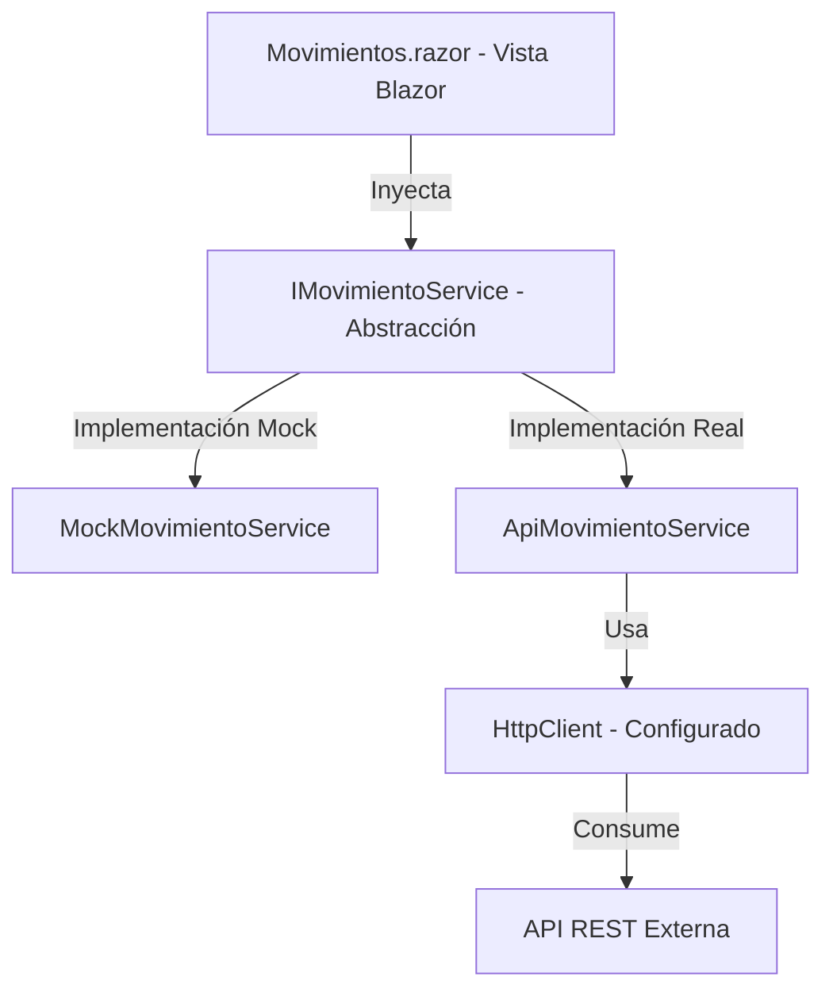

# Arquitectura de la Aplicación

Este documento describe las decisiones de diseño técnico adoptadas para la aplicación **ZiurSoftwareChallenge**, una solución desarrollada sobre Blazor Web App con .NET 9.

## 1. Diseño de Arquitectura y SOLID

La aplicación sigue principios de desarrollo limpio, orientados al desacoplamiento y la alta cohesión:



### Principios Aplicados
* **Inversión de Dependencias (DIP)**: Los componentes de la interfaz de usuario no dependen directamente de las clases de acceso a datos (`MockMovimientoService` o `ApiMovimientoService`), sino de la abstracción `IMovimientoService`.
* **Principio de Responsabilidad Única (SRP)**:
  * El modelo `Movimiento` solo representa los datos.
  * El servicio de movimientos encapsula la lógica de comunicación HTTP y deserialización.
  * El componente Razor se limita a presentar la información en la grilla y reaccionar a los cambios de estado.
* **Principio Abierto/Cerrado (OCP)**: La aplicación permite cambiar el proveedor de datos de un entorno simulado a uno real simplemente modificando un archivo de configuración, sin tocar el código compilado.

---

## 2. Configuración Dinámica de Servicios (Mock vs. API Real)

Para facilitar la transición y pruebas cuando se reciba la API definitiva, se ha implementado un mecanismo de alternancia en [Program.cs](file:///c:/Users/Lenovo/ZiurSoftwareChallenge/src/ZiurSoftwareChallenge/Program.cs).

### Configuración en `appsettings.json`
El nodo `"Api"` controla este comportamiento:
```json
"Api": {
  "UseMock": true,
  "BaseUrl": "https://pendiente-de-ziur.com/"
}
```

* **`UseMock: true`**: La aplicación resuelve `IMovimientoService` utilizando `MockMovimientoService`. Este servicio simula un retardo de red de 500 ms y devuelve un conjunto de datos estáticos alineado con el JSON esperado por el reto.
* **`UseMock: false`**: La aplicación resuelve `IMovimientoService` registrando un `HttpClient` tipado hacia `ApiMovimientoService`, apuntando el `BaseAddress` a la URL configurada en `BaseUrl`.

---

## 3. Modelo de Datos
La clase de intercambio está estructurada en [Movimiento.cs](file:///c:/Users/Lenovo/ZiurSoftwareChallenge/src/ZiurSoftwareChallenge/Models/Movimiento.cs) y consta de:
* `Codigo` (`int`): Clave identificadora del movimiento.
* `Descripcion` (`string`): Nombre o descripción detallada del movimiento.
* `VActiva` (`bool`): Indicador booleano que define si el movimiento está activo o inactivo.

---

## 4. UI y Presentación
El componente principal [Movimientos.razor](file:///c:/Users/Lenovo/ZiurSoftwareChallenge/src/ZiurSoftwareChallenge/Components/Pages/Movimientos.razor) maneja tres estados visuales diferenciados:
1. **Estado de Carga (`movimientos == null`)**: Muestra un spinner de carga y un mensaje indicador.
2. **Estado Vacío (`movimientos.Count == 0`)**: Muestra una alerta informativa indicando la ausencia de datos.
3. **Estado de Renderizado**: Presenta una tabla responsiva con estilos visuales contextuales (badges de color diferenciado para activos e inactivos).
